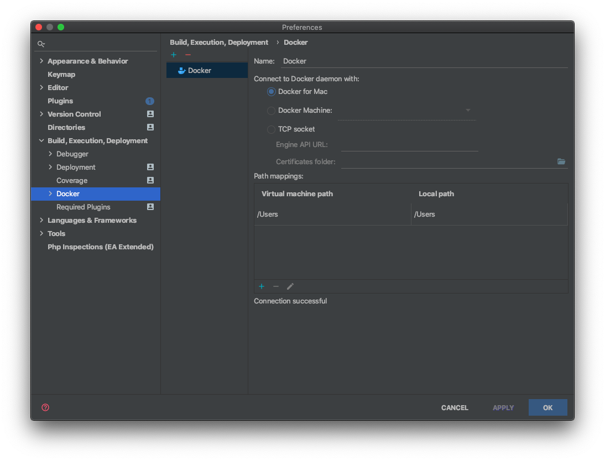
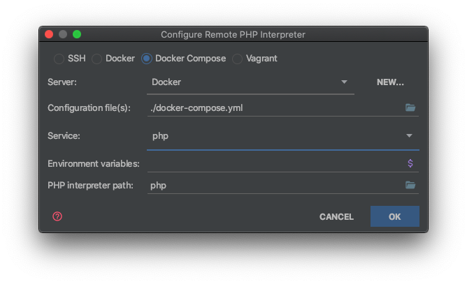
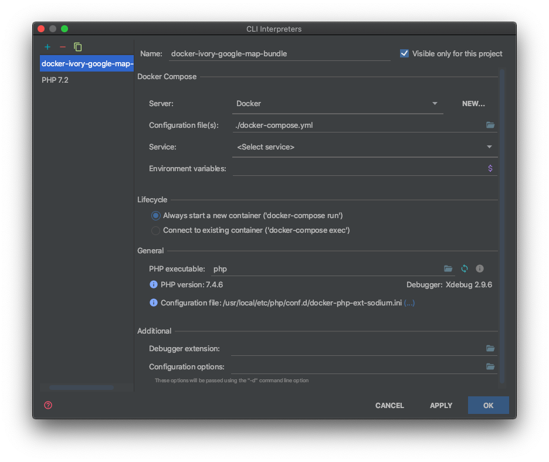
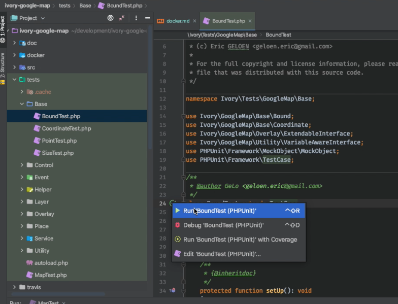
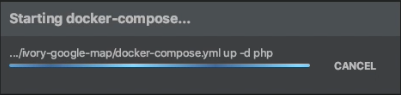
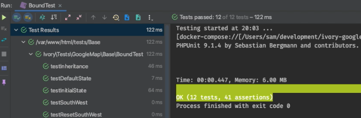

# Development Environment

The most easy way to set up the project is to install [Docker](https://www.docker.com) and
[Docker Composer](https://docs.docker.com/compose/) and build the project.

## Configure

The configuration is shipped with a distribution environment file allowing you to customize your IDE and XDebug
settings as well as your current user/group ID:

``` bash
$ cp .env.dist .env
```

**The most important part is the `USER_ID` and `GROUP_ID` which should match your current user/group.**

## Build

Once you have configured your environment, you can build the project:

``` bash
$ docker-compose build
```

## Composer

Install the dependencies via [Composer](https://getcomposer.org/):

``` bash
$ docker-compose run --rm php composer install
```

## Tests

To run the test suite, you can use:

``` bash
$ docker-compose up -d
```

Composer install:

``` bash
$ docker-compose run --rm php composer install
```

To run phpunit:

``` bash
$ docker-compose run --rm php vendor/bin/phpunit
```

## XDebug

If you want to use XDebug, make sure you have fully configured your `.env` file and use:

``` bash
$ docker-compose run --rm -e XDEBUG=1 php vendor/bin/phpunit
```
## Tests with PHP Storm integration

Configure PHP Storm for Docker (just create your config):




Create a Docker Compose Remote CLI Interpreter:

Preferences > Language & Frameworks > PHP 




Your Config should look like this:




You are ready to start testing:




At first time it takes some time to build containers




Test results




## Observe Selenium Tests

Get a VNC Client like [VNC Viewer](https://www.realvnc.com/de/connect/download/viewer/)

Start yout Test Environment and connect the viewer to `localhost:5900`

If you get asked for a password it's `secret`